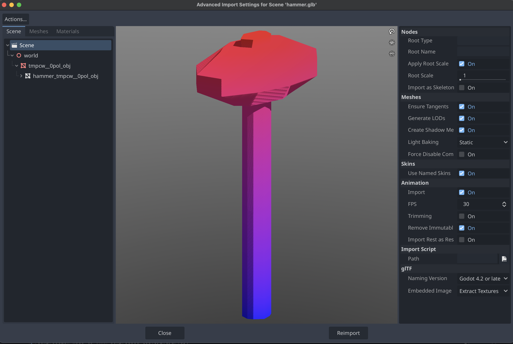
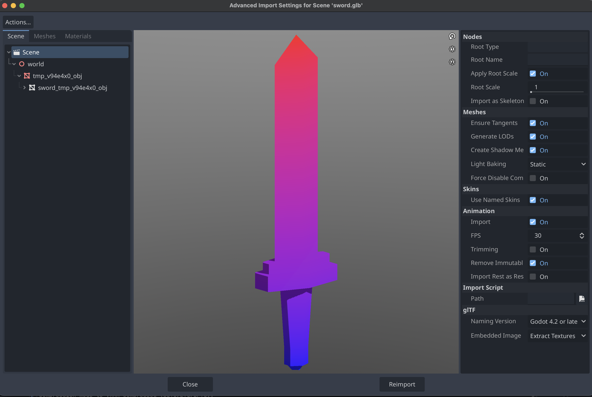

# generate-glb

<div style="text-align:center;">
  
</div>

## Instructions

### Setup

Instantiate a Python virtual environment

```pyenv virtualenv 3.11.6 generate-glb-env```

Activate virtual environment

```pyenv activate generate-glb-env```

Install requirements

```pip install -r requirements.txt```

### Usage
```
usage: generate.py [-h] [--temperature TEMPERATURE] [--max-tokens MAX_TOKENS] [--output OUTPUT] [--verbose]
                   [--timeout TIMEOUT] [--backend {transformers,llama_cpp,ollama}] [--model-path MODEL_PATH]
                   [--ollama-host OLLAMA_HOST] [--variant VARIANT] [--list-variants]
                   prompt

Generate 3D meshes using LLaMA-Mesh from command line

positional arguments:
  prompt                Prompt for generating the 3D mesh

options:
  -h, --help            show this help message and exit
  --temperature TEMPERATURE
                        Temperature for generation (default: 0.95)
  --max-tokens MAX_TOKENS
                        Maximum number of tokens to generate (default: 4096)
  --output OUTPUT       Output filename for the GLB file (default: output.glb)
  --verbose             Display vertices and faces as they are generated
  --timeout TIMEOUT     Timeout in seconds for generation (default: 900.0)
  --backend {transformers,llama_cpp,ollama}
                        Backend to use for generation
  --model-path MODEL_PATH
                        Path to model file (if not specified, will download from HuggingFace)
  --ollama-host OLLAMA_HOST
                        Host address for Ollama backend
  --variant VARIANT     Model variant to use (default: q4_k_m)
  --list-variants       List available model variants and exit
```

## Example

### Command
```shell
python generate.py \
  --temperature 0.95 \
  --max-tokens 4096 \
  --output sword.glb \
  "Create a 3D model of a sword"
```

### Model

<div style="text-align:center;">
  
</div>

### Output
```
Generating 3D mesh for prompt: Create a 3D model of a sword
Using temperature: 0.95
Max tokens: 4096
Using backend: transformers
Using model variant: q4_k_m
Loading checkpoint shards: 100%|████████████████████████████████████████████████████████| 4/4 [00:06<00:00,  1.50s/it]

Performance Statistics:
--------------------------------------------------
Total Processing Time: 136.96 seconds
├─ Model Load Time: 6.85 seconds
├─ Generation Time: 128.37 seconds
└─ Export Time: 0.00 seconds

Memory Usage:
├─ Initial: 51.9 MB
├─ Peak: 6140.8 MB
└─ Delta: 6088.9 MB

CPU Usage: 0.0%

Mesh saved to: sword.glb
```

## Credits & Acknowledgments

This project is based on [LLaMA-Mesh](https://github.com/nv-tlabs/LLaMA-Mesh) and incorporates code licensed under the NVIDIA License.

Original work by **NVIDIA Toronto AI Lab** is licensed under the **NVIDIA License** (see `LICENSE_NVIDIA`).

This project also derives portions from [meshgen](https://github.com/huggingface/meshgen) (Copyright (c) 2024 Hugging Face) and licensed under the MIT License.

All modifications and additional code contributions in this repository are licensed under the **MIT License** (Copyright (c) 2025 Steven Castellotti).

This software also uses the Llama model, which is governed by the **Llama Community License** (see `LICENSE_LLAMA`).
